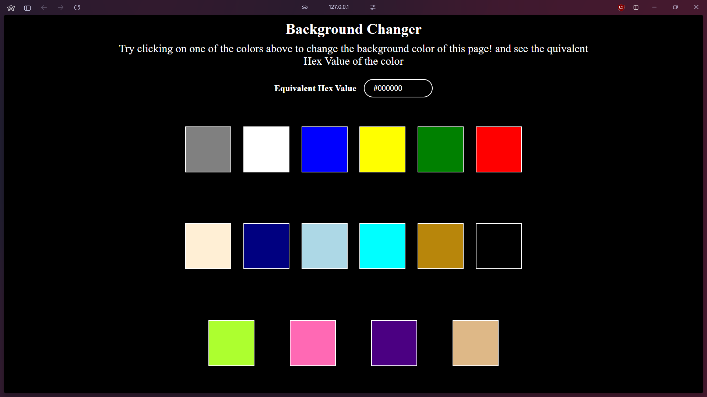

# 🌐 Web Development Practice Projects (HTML, CSS, JavaScript)

Welcome to this beginner-friendly repository of basic **Web Development Projects** designed to help you learn and practice **HTML**, **CSS**, and **JavaScript**. Each project is simple yet useful, perfect for understanding key frontend concepts.

---

## 📁 List of Projects

### 1. 🛒 Amazon Home Page Clone
A clone of the Amazon.com home page using only HTML and CSS to replicate the layout and design.

**Tech Used**: HTML, CSS  
**Preview**:  
  
  


---

### 2. 🕰️ Analog Clock
A fully functional analog clock showing the current time dynamically using JavaScript.

**Tech Used**: HTML, CSS, JavaScript  
**Preview**:  
 

---

### 3. ⏰ Digital Clock
Real-time digital clock with hours, minutes, and seconds.

**Tech Used**: HTML, CSS, JavaScript  
**Preview**:  


---

### 4. ✅ To-Do List App
Add, delete, and mark tasks as complete. Stored in memory.

**Tech Used**: HTML, CSS, JavaScript  
**Preview**:  
  
  
  

---

### 5. 🎙️ Speech to Text
Uses the Web Speech API to convert spoken words into text.

**Tech Used**: HTML, CSS, JavaScript (Web Speech API)  
**Preview**:  
 

---

### 6. 🗣️ Text to Speech
Convert typed text into spoken audio using the SpeechSynthesis API.

**Tech Used**: HTML, CSS, JavaScript (SpeechSynthesis API)  
**Preview**:  
  

---

### 7. 🎨 Background Color Changer
Random background color generator with every click.

**Tech Used**: HTML, CSS, JavaScript  
**Preview**:  
  
  
  
  

---

### 8. ⚖️ BMI Calculator
Calculate Body Mass Index (BMI) based on user input for weight and height.

**Tech Used**: HTML, CSS, JavaScript  
**Preview**:  
  
 

---

### 9. ⏳ Countdown Timer
Countdown to a specific future date with days, hours, minutes, and seconds.

**Tech Used**: HTML, CSS, JavaScript  
**Preview**:  
  


---

### 10. 📝 Form Validation
Form with input validations for name, email, password, etc.

**Tech Used**: HTML, CSS, JavaScript  
**Preview**:  
  


---

### 11. 🔢 Number Guessing Game
A fun number guessing game where you try to guess the correct number.

**Tech Used**: HTML, CSS, JavaScript  
**Preview**:  
   
   
   
 

---

### 12. 📜 Random Quotes Generator
Generates random motivational or funny quotes from a preset array.

**Tech Used**: HTML, CSS, JavaScript  
**Preview**:  
  


---

## 🛠️ How to Run Locally

1. Clone the repository:
```bash
git clone https://github.com/nikhilhuh/Web-Practice-Projects.git
```

2. Navigate to the project directory:
```bash
cd Web-Practice-Projects
```

3. Open the folder in your code editor (e.g., VS Code) and use an extension like Live Server to view the HTML files in the browser.
Alternatively, you can manually open each .html file in a web browser to test the project.

---

## 🚀 What's Inside?

This repository is a collection of beginner-level frontend projects built using only **HTML**, **CSS**, and **JavaScript**. Each project is:
- 🎯 Focused on specific core concepts
- 📦 Contained in its own folder
- 👀 Includes visual previews for easier understanding
- ✅ Perfect for learning, practice, and building a portfolio

---

## 📈 Learning Outcomes

By going through these projects, you will:

- Understand the basics of HTML structure and semantic tags
- Learn how to style components using CSS (Flexbox, Grid, Media Queries)
- Practice DOM manipulation and event handling in JavaScript
- Get familiar with working on small, manageable project folders
- Build confidence to take on bigger frontend or full-stack projects

---

## 🤝 Contributions

Want to improve a project or add your own?

1. Fork this repo
2. Create your feature branch (`git checkout -b feature-name`)
3. Commit your changes (`git commit -m 'Added a new project'`)
4. Push to the branch (`git push origin feature-name`)
5. Open a Pull Request

> 📌 Note: Make sure to include screenshots of your new project in the `/Previews` folder.

---

## ⭐ Support & Feedback

If you found this repository helpful, consider:

- 🌟 Starring the repo
- 🔁 Sharing with fellow learners
- 🧠 Giving suggestions for new project ideas

---

## 📬 Connect with Me

Made with ❤️ by **Nikhil Tiwari**  
💼 LinkedIn: [linkedin.com/in/nikhilhuh](https://linkedin.com/in/nikhilhuh)

---

## 📝 License

This repository has *NO LICENSE*.

---

> 🚀 Keep building, keep learning — every project you finish makes you a better developer!

